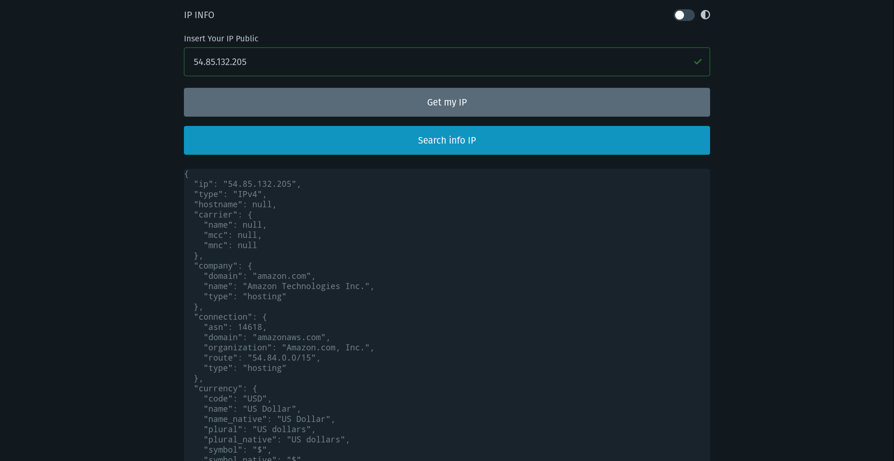

# **IP Information**

Project realized from vanilla JavaScript and Vite

extra:
- [Font Awesome](https://fontawesome.com/icons)
- [Pico.css](https://picocss.com/)
- [RapidAPI](https://rapidapi.com/hub)
- [IP Geolocation and Threat Detection (API)](https://rapidapi.com/ipregistry3-ipregistry/api/ip-geolocation-and-threat-detection/)

## **Start project in local**

In the archive .env add your API_KEY from [RapidAPI](https://rapidapi.com/hub)

# **Desktop Preview**

### **Theme Dark**

### **Theme Light**

# **Mobile Preview**

### **Theme Dark**

### **Theme Light**
